# Inventory and Order Management API

A backend REST API built with Java, Spring Boot, PostgreSQL, Spring Data JPA, Flyway, and Docker.

The project manages products, customers, inventory stock, and customer orders with transactional stock updates. It demonstrates real-world backend development concepts such as REST API design, PostgreSQL schema modeling, database migrations, transaction management, pagination, sorting, error handling, and SQL verification.

---

## Tech Stack

- Java
- Spring Boot
- Spring Web
- Spring Data JPA
- PostgreSQL
- Flyway Migration
- Docker Compose
- Hibernate Validator
- Lombok
- Postman
- Maven

---

## Project Overview

This project simulates a small inventory and order management backend system.

It supports:

- Product management
- Customer management
- Multi-item order placement
- Transactional inventory updates
- Stock validation
- Low-stock reporting
- Pagination and sorting
- PostgreSQL schema design with indexes and foreign keys
- Clean API error handling
- SQL-based verification of database relationships

---

## Architecture

```text
Client / Postman
      |
      v
Spring Boot REST Controllers
      |
      v
Service Layer
      |
      v
Spring Data JPA Repository Layer
      |
      v
PostgreSQL Database running in Docker
```

---

## Database Tables

The database contains the following tables:

```text
products
customers
orders
order_items
flyway_schema_history
```

---

## Entity Relationships

```text
One customer can have many orders.
One order can have many order items.
One order item belongs to one product.
```

Relationship flow:

```text
customers.customer_id
        ↓
orders.customer_id
        ↓
order_items.order_id
        ↓
products.product_id
```

---

## Features

### Product APIs

| Method | Endpoint | Description |
|---|---|---|
| POST | `/api/products` | Create product |
| GET | `/api/products` | Get all products |
| GET | `/api/products/{productId}` | Get product by ID |
| PUT | `/api/products/{productId}` | Update product |
| DELETE | `/api/products/{productId}` | Delete product |
| GET | `/api/products/category/{category}` | Get products by category |
| GET | `/api/products/search?name=mouse` | Search products by name |
| GET | `/api/products/low-stock?threshold=10` | Get low-stock products |
| GET | `/api/products/paged?page=0&size=5&sortBy=productId&sortDirection=asc` | Get paginated products |

### Customer APIs

| Method | Endpoint | Description |
|---|---|---|
| POST | `/api/customers` | Create customer |
| GET | `/api/customers` | Get all customers |
| GET | `/api/customers/{customerId}` | Get customer by ID |
| GET | `/api/customers/email?email=john@example.com` | Get customer by email |
| PUT | `/api/customers/{customerId}` | Update customer |
| DELETE | `/api/customers/{customerId}` | Delete customer |

### Order APIs

| Method | Endpoint | Description |
|---|---|---|
| POST | `/api/orders` | Place order |
| GET | `/api/orders/{orderId}` | Get order by ID |
| GET | `/api/orders/customer/{customerId}` | Get all orders for a customer |

---

## Core Business Logic

The order placement API performs the following operations inside a transaction:

```text
1. Validate customer exists
2. Validate each product exists
3. Check available stock
4. Reduce product stock
5. Calculate line item totals
6. Calculate total order amount
7. Save order and order items
8. Roll back if any step fails
```

This prevents invalid orders and protects inventory consistency.

---

## Example Product Request

```json
{
  "name": "Wireless Mouse",
  "description": "Ergonomic wireless mouse with USB receiver",
  "category": "Electronics",
  "price": 25.99,
  "stockQuantity": 50
}
```

---

## Example Customer Request

```json
{
  "name": "John Smith",
  "email": "john@example.com",
  "phone": "5131112222",
  "address": "Cincinnati, OH"
}
```

---

## Example Order Request

```json
{
  "customerId": 1,
  "items": [
    {
      "productId": 2,
      "quantity": 2
    },
    {
      "productId": 3,
      "quantity": 1
    }
  ]
}
```

---

## Example Error Response

```json
{
  "status": 400,
  "message": "Product not found with id: 1",
  "path": "/api/orders",
  "timestamp": "2026-05-28T15:05:30"
}
```

---

## API Testing Screenshots

The APIs were tested using Postman, and database results were verified directly in PostgreSQL using SQL queries.

### Product Creation API

```http
POST /api/products
```

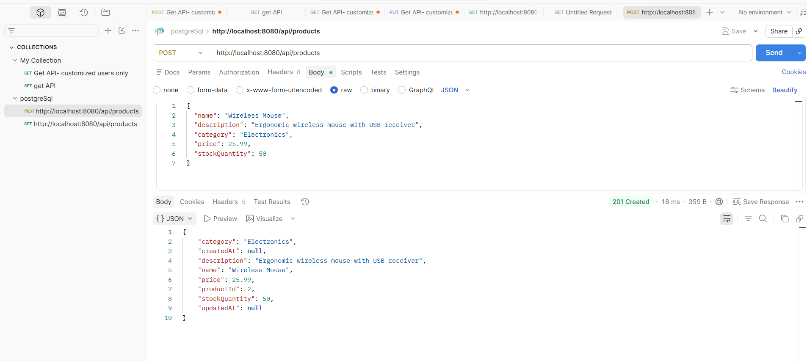

### Get Products API

```http
GET /api/products
```

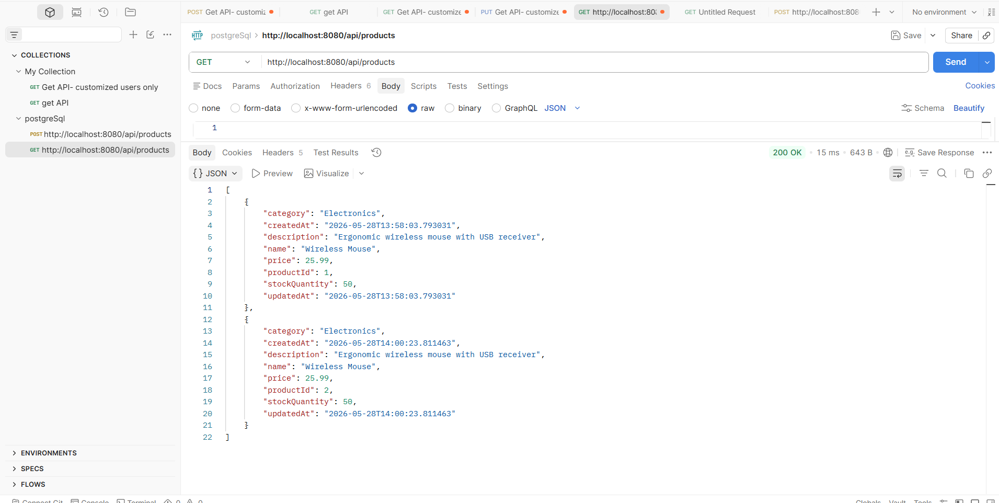

### Get Product by ID API

```http
GET /api/products/{productId}
```

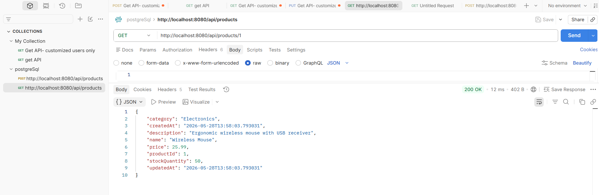

### Product Search by Category API

```http
GET /api/products/category/{category}
```


### Product Search by Name API

```http
GET /api/products/search?name=mouse
```


### Low Stock Products API

```http
GET /api/products/low-stock?threshold=10
```

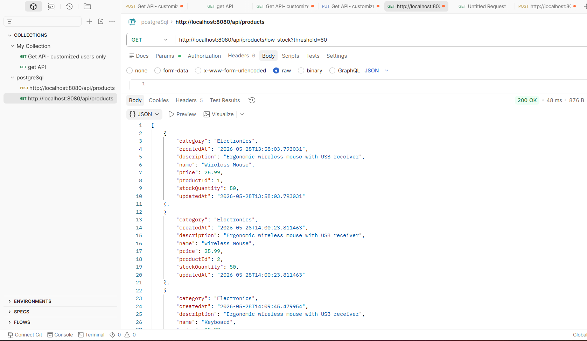

### Product Update API

```http
PUT /api/products/{productId}
```

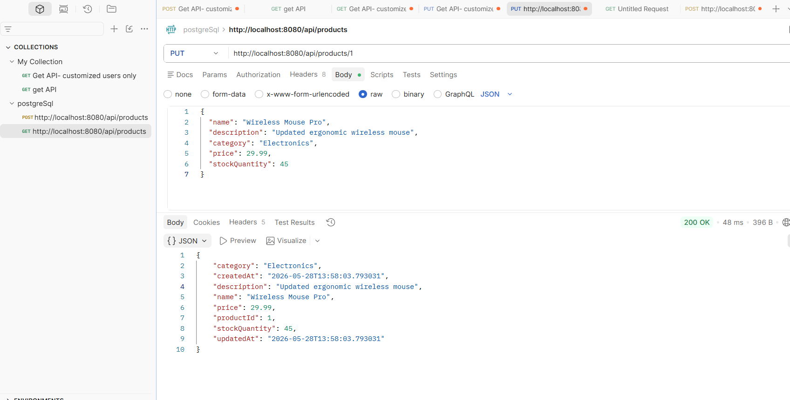

### Customer Creation API

```http
POST /api/customers
```

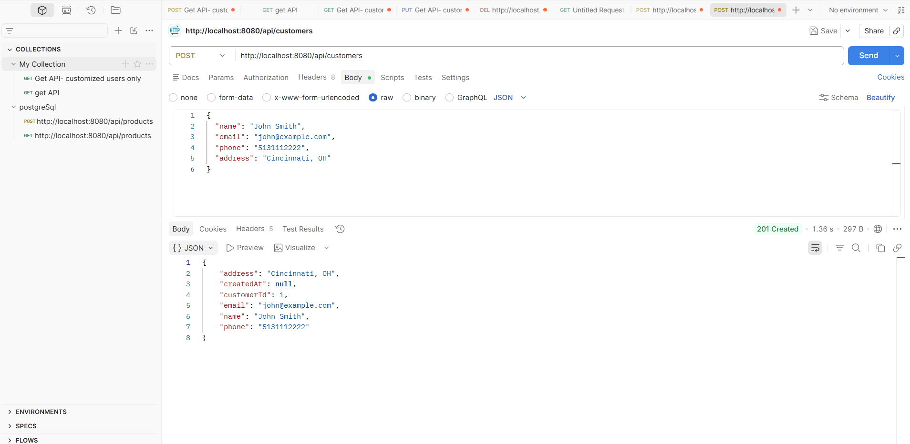

### Customer Update API

```http
PUT /api/customers/{customerId}
```

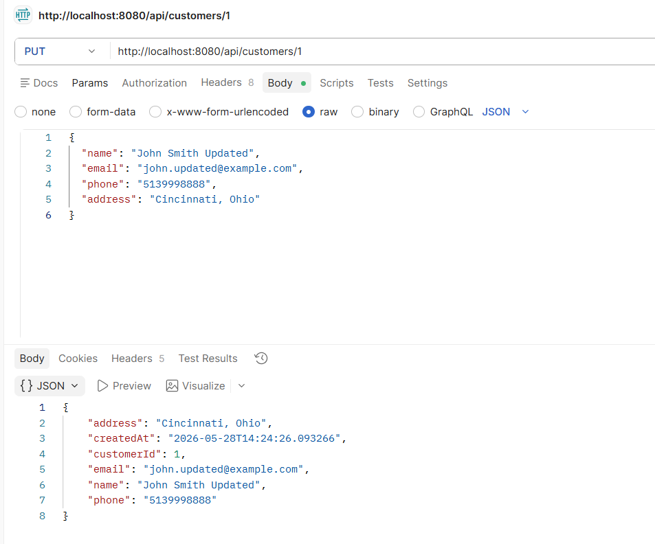

### Order Placement API

```http
POST /api/orders
```

This API validates the customer, checks product availability, reduces stock, calculates total amount, and saves order items inside a transaction.

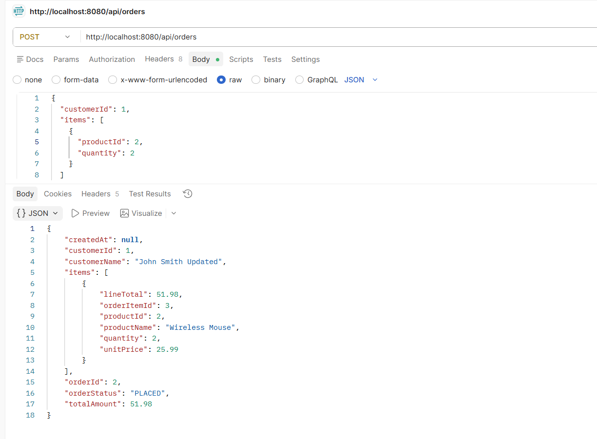

### Customer Order History API

```http
GET /api/orders/customer/{customerId}
```

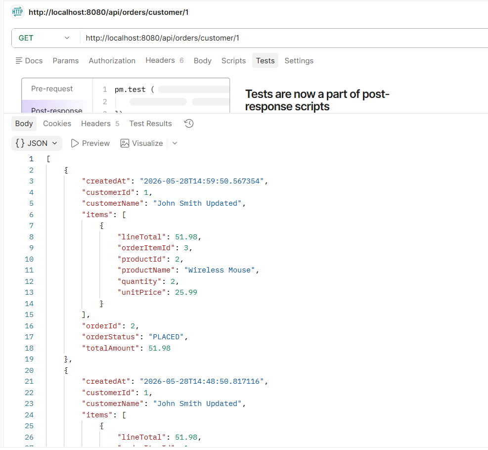

### Error Handling Response

The application returns clean JSON error responses for invalid requests.

```http
POST /api/orders
```

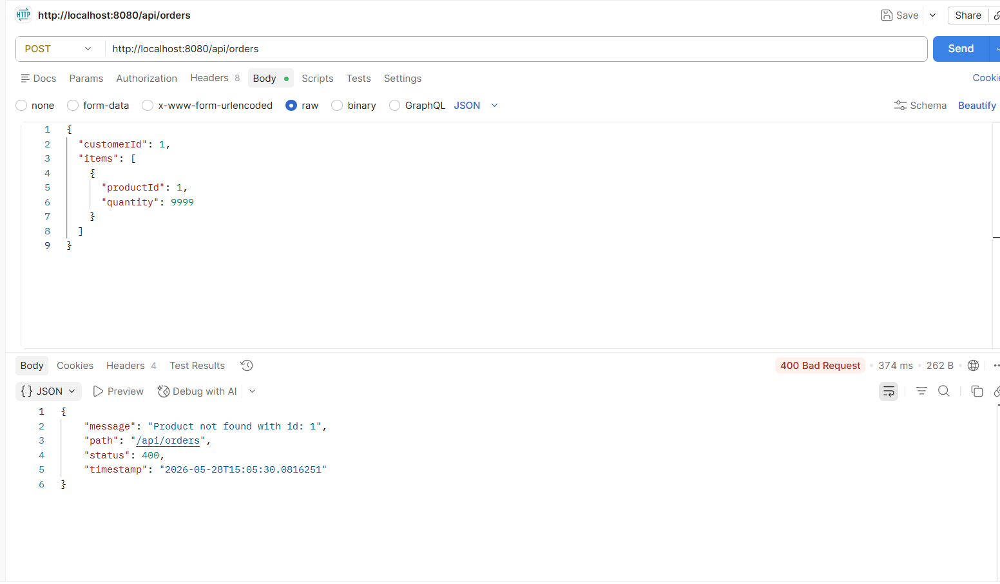

### Paginated Product API

```http
GET /api/products/paged?page=0&size=2&sortBy=productId&sortDirection=asc
```

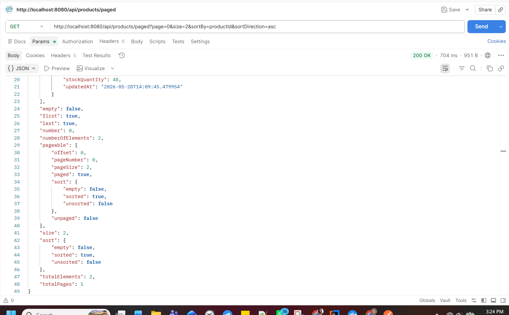

### PostgreSQL Join Verification

The order, customer, product, and order item relationships were verified using a SQL join query.

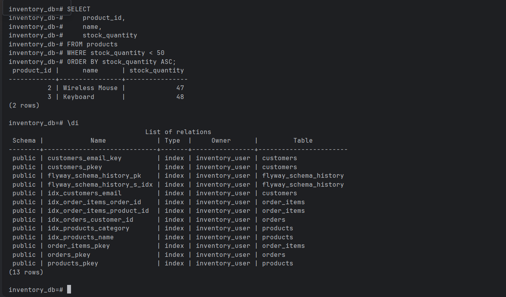

---

## Full API Testing Documentation

Detailed API testing screenshots and PostgreSQL verification steps are available in the project documentation.

[View API Testing Documentation](docs/PostgreSQL_API_Testing_Documentation.docx)

---

## PostgreSQL Schema Highlights

The project uses:

- Primary keys
- Foreign keys
- Unique constraints
- Check constraints
- Indexes
- Join queries
- Transactional updates

Indexes created:

```sql
CREATE INDEX idx_products_category ON products(category);
CREATE INDEX idx_products_name ON products(name);
CREATE INDEX idx_customers_email ON customers(email);
CREATE INDEX idx_orders_customer_id ON orders(customer_id);
CREATE INDEX idx_order_items_order_id ON order_items(order_id);
CREATE INDEX idx_order_items_product_id ON order_items(product_id);
```

---

## Important SQL Join Query

```sql
SELECT 
    o.order_id,
    c.name AS customer_name,
    p.name AS product_name,
    oi.quantity,
    oi.unit_price,
    oi.quantity * oi.unit_price AS line_total,
    o.total_amount,
    o.order_status,
    o.created_at
FROM orders o
JOIN customers c ON o.customer_id = c.customer_id
JOIN order_items oi ON o.order_id = oi.order_id
JOIN products p ON oi.product_id = p.product_id
ORDER BY o.created_at DESC;
```

---

## Running the Project Locally

### 1. Clone the repository

```bash
git clone https://github.com/soundaryapoovaiah/inventory-order-management-api.git
cd inventory-order-management-api
```

### 2. Start PostgreSQL using Docker

```bash
docker compose up -d
```

### 3. Verify PostgreSQL container

```bash
docker ps
```

### 4. Run Spring Boot application

```bash
./mvnw spring-boot:run
```

On Windows PowerShell:

```bash
.\mvnw spring-boot:run
```

### 5. Application URL

```text
http://localhost:8080
```

---

## PostgreSQL Connection Details

```text
Database: inventory_db
Username: inventory_user
Password: inventory_pass
Port: 5432
```

---

## Flyway Migration

Database tables are created using Flyway migration.

Migration file:

```text
src/main/resources/db/migration/V1__inventory_schema.sql
```

---

## Project Structure

```text
src/main/java/microservices/postgresql
├── controller
├── dto
├── entity
├── exception
├── repository
├── service
└── PostgreSqlApplication.java

src/main/resources
├── db/migration/V1__inventory_schema.sql
└── application.properties

docs
├── screenshots
└── PostgreSQL_API_Testing_Documentation.docx
```

---

## Key Learning Outcomes

This project demonstrates:

- REST API development using Spring Boot
- PostgreSQL database design
- Transaction management using `@Transactional`
- Spring Data JPA repository methods
- Docker-based local database setup
- Flyway database migration
- Pagination and sorting
- Global exception handling
- Real-world backend service layering
- SQL join verification across normalized relational tables

---

## Resume Bullets

- Built an inventory and order management REST API using Java, Spring Boot, PostgreSQL, Docker, Spring Data JPA, and Flyway to manage products, customers, inventory stock, and customer orders.
- Implemented transactional order placement logic with customer validation, product validation, stock checks, inventory updates, total amount calculation, and rollback handling to maintain database consistency.
- Designed normalized PostgreSQL schemas with primary keys, foreign keys, constraints, indexes, and join queries to support product search, customer order history, low-stock reporting, and paginated APIs.
