# Inventory Order Management API


Production-style Java backend project built with **Spring Boot, PostgreSQL, Redis, Kafka, Docker, Flyway, GitHub Actions, Testcontainers, Prometheus, and Grafana**.

This project started as an inventory and order management REST API and was upgraded into a distributed backend system that demonstrates real-world engineering patterns used in enterprise and large-scale systems: transaction-safe inventory updates, idempotent order creation, Redis caching, Kafka event publishing, transactional outbox, CI validation, integration testing, and observability.

---

## Why This Project Matters

This is not only a CRUD API. It demonstrates backend engineering concepts that are expected in Java developer roles at Fortune 500 companies and large technology teams:

- Transaction-safe order placement using PostgreSQL row-level locking
- Duplicate order prevention using idempotency keys
- Redis caching for high-read product lookup APIs
- Kafka-based asynchronous event publishing
- Transactional outbox pattern for reliable event delivery
- PostgreSQL schema migrations using Flyway
- Testcontainers integration testing with real PostgreSQL
- GitHub Actions CI pipeline
- Spring Boot Actuator, Prometheus, and Grafana observability
- Swagger/OpenAPI API documentation

---

## Tech Stack

| Area | Technology |
|---|---|
| Language | Java 17 |
| Backend | Spring Boot, Spring Web, Spring Data JPA |
| Database | PostgreSQL |
| Migration | Flyway |
| Caching | Redis |
| Messaging | Apache Kafka |
| Reliability Pattern | Transactional Outbox |
| Testing | JUnit, Testcontainers |
| CI/CD | GitHub Actions |
| Observability | Spring Boot Actuator, Micrometer, Prometheus, Grafana |
| Documentation | Swagger/OpenAPI |
| Containerization | Docker, Docker Compose |
| Build Tool | Maven |

---

## System Architecture
```md
<p align="center">
  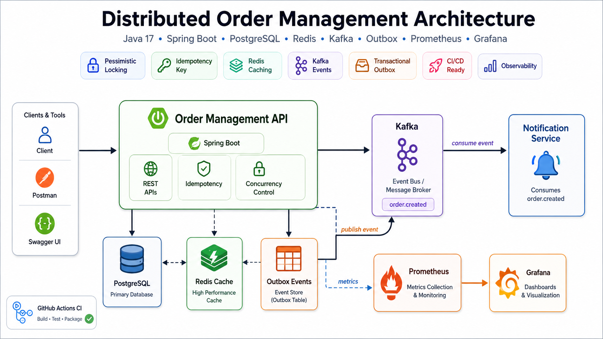
</p>
```


```text
Client / Postman / Swagger
        |
        v
Spring Boot REST Controllers
        |
        v
Service Layer
        |
        +-----------------------------+
        |                             |
        v                             v
PostgreSQL                      Redis Cache
Products, Customers,            Product lookup cache
Orders, Order Items,
Outbox Events
        |
        v
Scheduled Outbox Publisher
        |
        v
Apache Kafka
order.created topic
        |
        v
Downstream consumers
```

---

## Core Order Flow

```text
1. Customer submits an order through POST /api/orders
2. API validates customer and product details
3. Product rows are locked using PostgreSQL pessimistic locking
4. Stock availability is checked inside a transaction
5. Inventory is deducted safely
6. Order and order items are saved
7. Order-created event is saved into outbox_events table
8. Scheduled outbox publisher sends the event to Kafka
9. Outbox event is marked as PUBLISHED
10. Prometheus and Grafana monitor application metrics
```

---

## Key Features

### 1. Product and Customer APIs

The application supports product and customer management with validation, pagination, sorting, filtering, and clean error handling.

| Method | Endpoint | Description |
|---|---|---|
| POST | `/api/products` | Create product |
| GET | `/api/products` | Get all products |
| GET | `/api/products/{productId}` | Get product by ID |
| PUT | `/api/products/{productId}` | Update product |
| DELETE | `/api/products/{productId}` | Delete product |
| GET | `/api/products/category/{category}` | Get products by category |
| GET | `/api/products/search?name=mouse` | Search products by name |
| GET | `/api/products/low-stock?threshold=10` | Get low-stock products |
| GET | `/api/products/paged?page=0&size=5&sortBy=productId&sortDirection=asc` | Get paginated products |
| POST | `/api/customers` | Create customer |
| GET | `/api/customers` | Get all customers |
| GET | `/api/customers/{customerId}` | Get customer by ID |
| PUT | `/api/customers/{customerId}` | Update customer |
| DELETE | `/api/customers/{customerId}` | Delete customer |

### 2. Transaction-Safe Order Placement

Order placement runs inside a database transaction and protects inventory consistency.

| Method | Endpoint | Description |
|---|---|---|
| POST | `/api/orders` | Place order |
| GET | `/api/orders/{orderId}` | Get order by ID |
| GET | `/api/orders/customer/{customerId}` | Get customer order history |

Order placement validates the customer, validates each product, checks stock, deducts inventory, calculates order totals, saves order items, and rolls back if any step fails.

### 3. Concurrency Handling

The system prevents overselling during concurrent checkout requests using PostgreSQL row-level pessimistic locking.

```java
@Lock(LockModeType.PESSIMISTIC_WRITE)
@Query("SELECT p FROM Product p WHERE p.productId = :productId")
Optional<Product> findByIdForUpdate(@Param("productId") Long productId);
```

Concurrency proof:

```text
Request 1: HTTP_STATUS:201
Request 2: HTTP_STATUS:400
Final stock quantity: 0
```

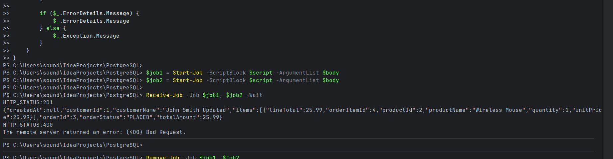

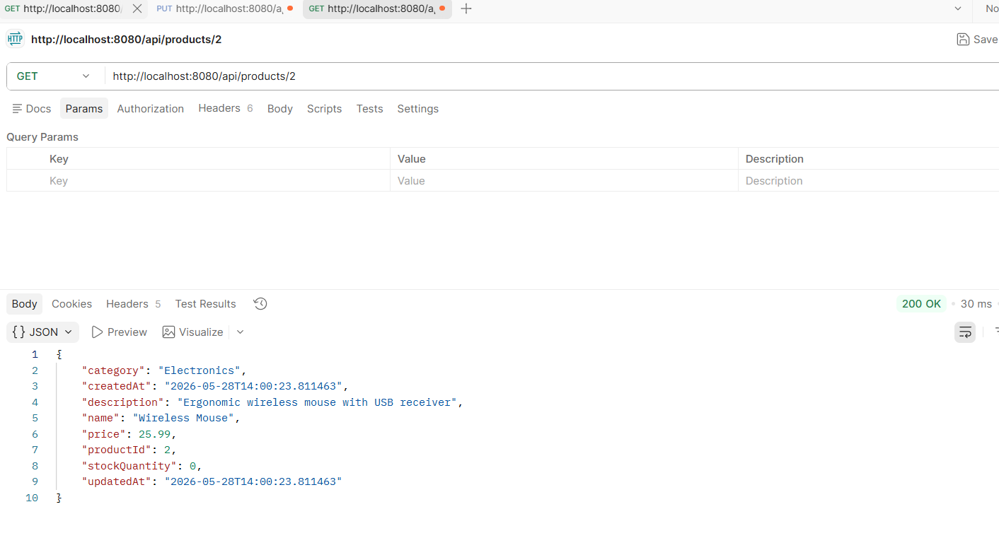

### 4. Idempotent Order Creation

The API supports an `Idempotency-Key` request header to prevent duplicate order creation when a client retries the same request.

```http
POST /api/orders
Idempotency-Key: demo-order-001
```

Expected behavior:

```text
First request  -> 201 Created
Second request -> 200 OK with same orderId
```

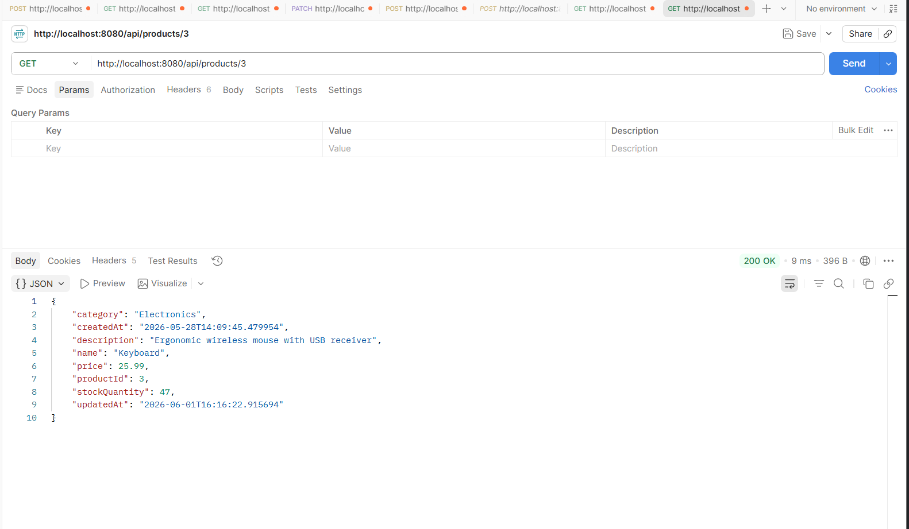

### 5. Redis Caching

Product lookup uses Redis caching to reduce repeated PostgreSQL reads for frequently accessed products.

```text
GET /api/products/3
```

First request hits PostgreSQL. Repeated requests return from Redis until the cache expires or the product is updated/deleted.

Redis verification:

```text
productById::3
```

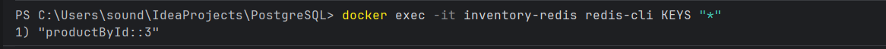

### 6. Kafka Event Publishing

When an order is placed, the system publishes an `order.created` event to Kafka.

```text
Topic: order.created
Key: orderId
Value: order-created JSON payload
```

Example event:

```json
{
  "orderId": 5,
  "customerId": 1,
  "customerName": "John Smith Updated",
  "orderStatus": "PLACED",
  "totalAmount": 25.99,
  "items": [
    {
      "productId": 3,
      "productName": "Keyboard",
      "quantity": 1,
      "unitPrice": 25.99
    }
  ]
}
```

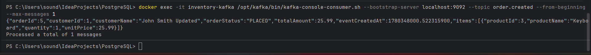

### 7. Transactional Outbox Pattern

The project uses the transactional outbox pattern to avoid inconsistencies between PostgreSQL and Kafka.

Instead of publishing directly to Kafka inside the order transaction, the application saves an event to the `outbox_events` table in the same transaction as the order. A scheduled publisher later reads pending outbox events, publishes them to Kafka, and marks them as `PUBLISHED`.

```text
Order transaction
    |
    +-- Save order
    +-- Save outbox event with status PENDING

Scheduled publisher
    |
    +-- Read PENDING events
    +-- Publish to Kafka
    +-- Mark as PUBLISHED
```

Outbox verification:

```sql
SELECT aggregate_id, event_type, status, topic
FROM outbox_events
ORDER BY created_at DESC
LIMIT 5;
```

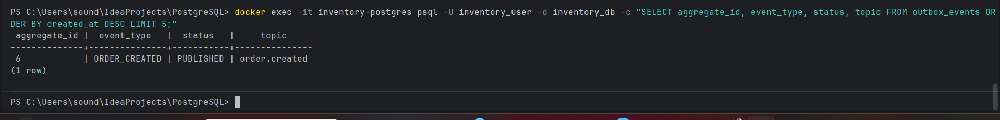

### 8. API Documentation with Swagger

Swagger/OpenAPI is enabled for API testing and documentation.

```text
http://localhost:8080/swagger-ui.html
```

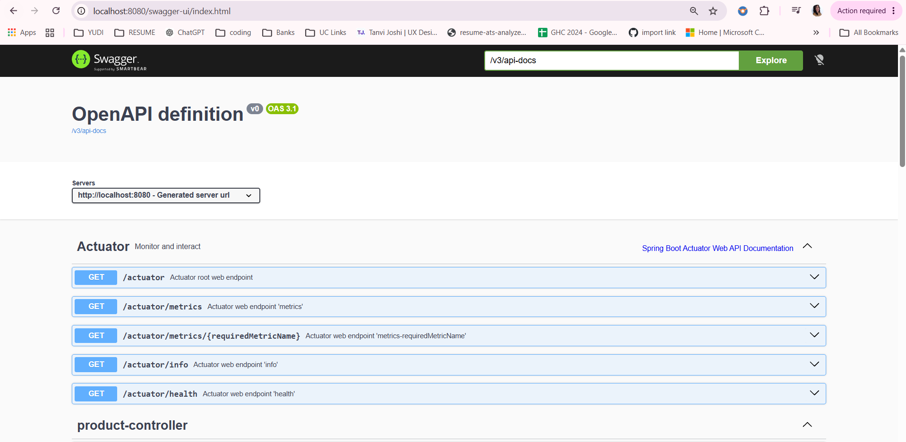

### 9. CI Pipeline with GitHub Actions

Every push to `main` runs a GitHub Actions workflow that builds the project and runs tests.

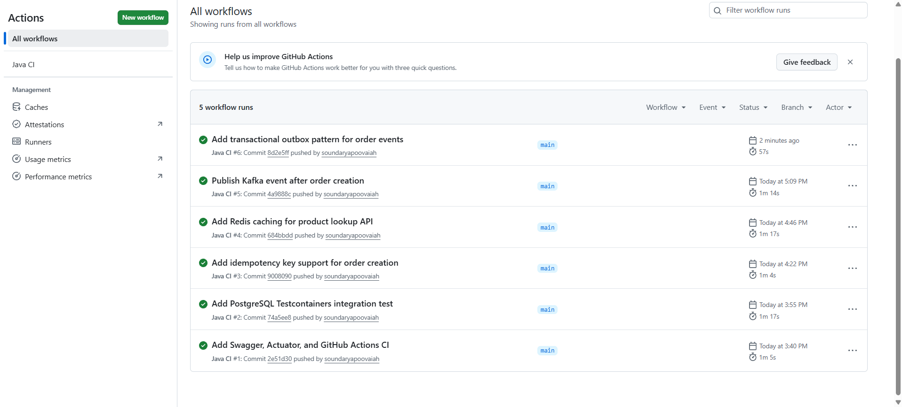

### 10. Testcontainers Integration Testing

The project includes integration tests that run against a real PostgreSQL container using Testcontainers. This validates database connectivity, JPA mappings, repository behavior, and migration compatibility.

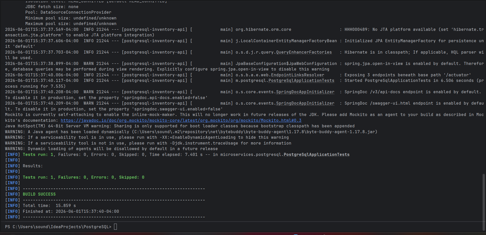

### 11. Observability with Prometheus and Grafana

Spring Boot Actuator exposes metrics through `/actuator/prometheus`. Prometheus scrapes those metrics, and Grafana visualizes request rate and JVM memory usage.

```text
Spring Boot Actuator -> Prometheus -> Grafana
```

Prometheus target health:

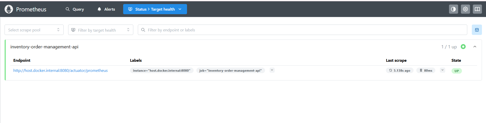

Grafana dashboard:

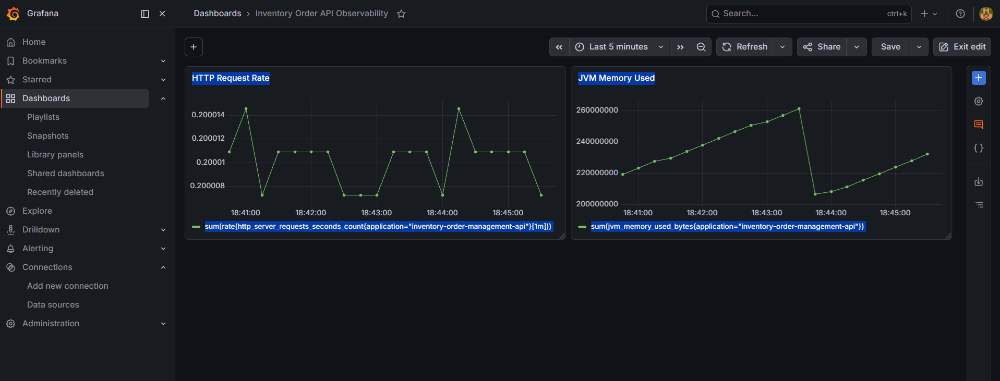

---

## Database Schema

The project uses normalized relational tables with constraints, indexes, and Flyway migrations.

```text
products
customers
orders
order_items
outbox_events
flyway_schema_history
```

Relationship flow:

```text
customers.customer_id
        |
        v
orders.customer_id
        |
        v
order_items.order_id
        |
        v
products.product_id
```

Outbox flow:

```text
orders.order_id
        |
        v
outbox_events.aggregate_id
        |
        v
Kafka topic: order.created
```

---

## Flyway Migrations

| Version | Description |
|---|---|
| V1 | Inventory schema |
| V2 | PostgreSQL advanced features |
| V3 | Add order idempotency key |
| V4 | Create outbox events table |

---

## PostgreSQL Advanced Features

The project includes PostgreSQL-specific features beyond basic CRUD:

- PL/pgSQL function
- Database trigger
- Database view
- Automatic `updated_at` timestamp handling
- Customer order summary reporting
- Low-stock product reporting

V2 migration verification:

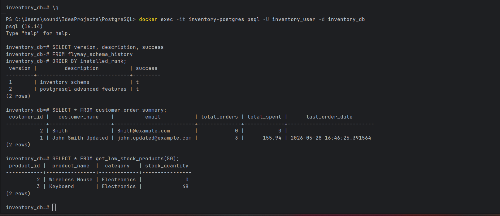

---

## API Examples

### Create Product

```http
POST /api/products
Content-Type: application/json
```

```json
{
  "name": "Wireless Mouse",
  "description": "Ergonomic wireless mouse with USB receiver",
  "category": "Electronics",
  "price": 25.99,
  "stockQuantity": 50
}
```

### Create Customer

```http
POST /api/customers
Content-Type: application/json
```

```json
{
  "name": "John Smith",
  "email": "john@example.com",
  "phone": "5131112222",
  "address": "Cincinnati, OH"
}
```

### Place Order

```http
POST /api/orders
Content-Type: application/json
Idempotency-Key: order-001
```

```json
{
  "customerId": 1,
  "items": [
    {
      "productId": 3,
      "quantity": 1
    }
  ]
}
```

### Example Error Response

```json
{
  "status": 400,
  "message": "Insufficient stock for product: Wireless Mouse. Available: 0, Requested: 1",
  "path": "/api/orders",
  "timestamp": "2026-06-01T16:14:53"
}
```

---

## Running Locally

### Prerequisites

Install:

- Java 17
- Docker Desktop
- Maven Wrapper is included in the project

### 1. Clone Repository

```bash
git clone https://github.com/soundaryapoovaiah/inventory-order-management-api.git
cd inventory-order-management-api
```

### 2. Start Infrastructure

```bash
docker compose up -d
```

This starts:

```text
PostgreSQL -> localhost:5432
Redis      -> localhost:6379
Kafka      -> localhost:9092
Prometheus -> localhost:9090
Grafana    -> localhost:3000
```

### 3. Run Spring Boot App

On macOS/Linux:

```bash
./mvnw spring-boot:run
```

On Windows PowerShell:

```powershell
.\mvnw spring-boot:run
```

### 4. Open Services

| Service | URL |
|---|---|
| API Base URL | `http://localhost:8080` |
| Swagger UI | `http://localhost:8080/swagger-ui.html` |
| Actuator Health | `http://localhost:8080/actuator/health` |
| Prometheus Metrics | `http://localhost:8080/actuator/prometheus` |
| Prometheus UI | `http://localhost:9090/targets` |
| Grafana UI | `http://localhost:3000` |

Grafana login:

```text
Username: admin
Password: admin
```

---

## Useful Verification Commands

### Check Docker Containers

```bash
docker ps
```

### Check Redis Cache Keys

```bash
docker exec -it inventory-redis redis-cli KEYS "*"
```

### Consume Kafka Order Events

```bash
docker exec -it inventory-kafka /opt/kafka/bin/kafka-console-consumer.sh --bootstrap-server localhost:9092 --topic order.created --from-beginning --max-messages 1
```

### Verify Outbox Events

```bash
docker exec -it inventory-postgres psql -U inventory_user -d inventory_db -c "SELECT aggregate_id, event_type, status, topic FROM outbox_events ORDER BY created_at DESC LIMIT 5;"
```

### Run Tests

```bash
./mvnw clean test -Dspring.docker.compose.enabled=false
```

On Windows PowerShell:

```powershell
.\mvnw clean test "-Dspring.docker.compose.enabled=false"
```

---

## Project Structure

```text
src/main/java/microservices/postgresql
├── config
│   ├── JacksonConfig.java
│   └── KafkaProducerConfig.java
├── controller
├── dto
├── entity
│   ├── Customer.java
│   ├── CustomerOrder.java
│   ├── OrderItem.java
│   ├── OutboxEvent.java
│   └── Product.java
├── event
│   └── OrderCreatedEvent.java
├── exception
├── messaging
│   └── OutboxEventPublisher.java
├── repository
├── service
└── PostgreSqlApplication.java

src/main/resources
├── db/migration
│   ├── V1__inventory_schema.sql
│   ├── V2__postgresql_advanced_features.sql
│   ├── V3__add_order_idempotency_key.sql
│   └── V4__create_outbox_events_table.sql
└── application.properties

monitoring
└── prometheus.yml

.github/workflows
└── ci.yml

docs
└── screenshots
```

---
---
## Author

**Soundarya Kookanda**  
Java Backend Developer focused on Spring Boot, PostgreSQL, cloud-ready backend systems and AI-integrated enterprise applications.
